## Overview

TRAX is a web application for the uploading, sharing and analysing activities which have been recorded in the GPX file format. TRAX is inspired by the [Strava](https://www.strava.com) web service.

The web application has been built using the Django framework and utilises a PostgreSQL database and the Cloudinary storage solution for the storing of activities. The application has been deployed to Heroku and can be accessed at the following link [trax-webapp.herokuapp.com](https://trax-webapp.herokuapp.com/).

## Table of Contents

- [Objectives](#objectives)
  * [User Stories](#user-stories)
- [Design](#design)
  * [Wireframes](#wireframes)
  * [Color Palette](#color-palette)
  * [Fonts](#fonts)
- [Database Model & Schema](#database-model---schema)
- [Features](#features)
  * [Implemented Features](#implemented-features)
  * [Future Additional Features](#future-additional-features)
- [Testing](#testing)
- [Deployment](#deployment)
  * [Heroku Deployment](#heroku-deployment)
- [Technologies Used](#technologies-used)
  * [Languages](#languages)
  * [Tools](#tools)
- [Credits](#credits)
  * [Libraries](#libraries)
  * [Code](#code)
  * [HTML / CSS](#html---css)
  * [Images](#images)
  * [Other](#other)


## Objectives

In developing the web application, I aimed to achieve the following technical objectives:

- Implement a full stack web application utilising the django framework
- Provide full C.R.U.D. functionality
- Deploy the web application to a cloud hosting framework

### User Stories

In order to implement the technical functionality, I defined and implemented a number of user stories. User Stories were tracked in GitHub using an agile framework planning tool. The full agile board can be found [here](https://github.com/users/eoinlarkin/projects/1)

- As a Site User: I can view a list of activites from other users
- As a Site User: when I can click on an activity I can visualise further details
- As a Site User / Admin: I can like favorite activities
- As a Site User: I can add description to my activites
- As a Site User: I can like or unlike a post
- As a Site User: I can register an account
- As a Site User: I can create, update and delete activity files
- As a Site User: Information from the uploaded activity file is parsed automatically and populated in the database
- As a Site Admin / User: The site features an About page with detail on the site features

## Design

In designing the site, I sought to combine a clean design which would highlight the site functionality. In order to accelerate development of the site, I used the [TailwindCSS framework](https://tailwindcss.com/).

### Wireframes
Prior to developing the webiste, I iterated on the design using wireframes. The wireframes developed were as follows:

- **Home**
  - <details>
    <summary><strong style="color:skyblue">Screenshot:</strong></summary>
    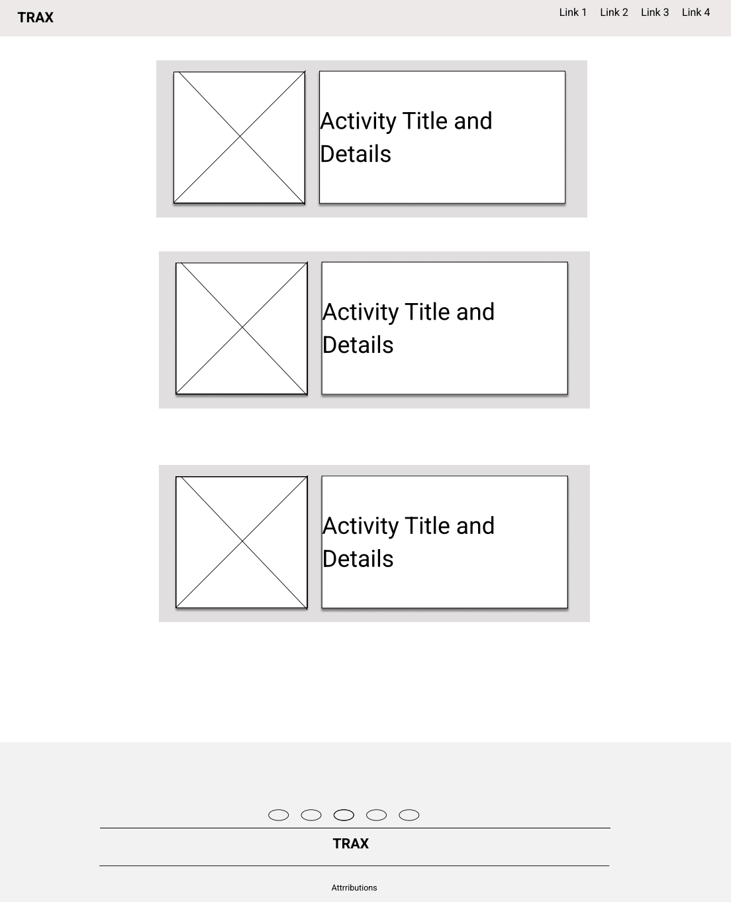
    </details>
- **Login / Signup / Register**
  - <details>
    <summary><strong style="color:skyblue">Screenshot:</strong></summary>
    
    </details>
- **Activity Details**
  - <details>
    <summary><strong style="color:skyblue">Screenshot:</strong></summary>
    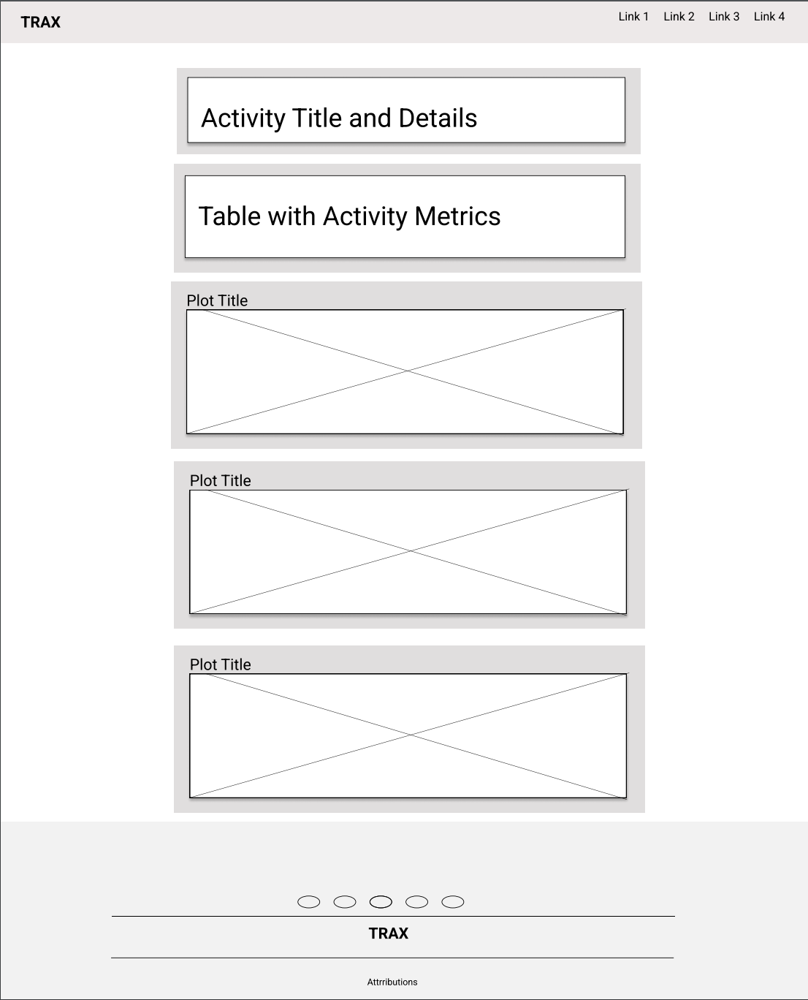
    </details>
- **About**
  - <details>
    <summary><strong style="color:skyblue">Screenshot:</strong></summary>
    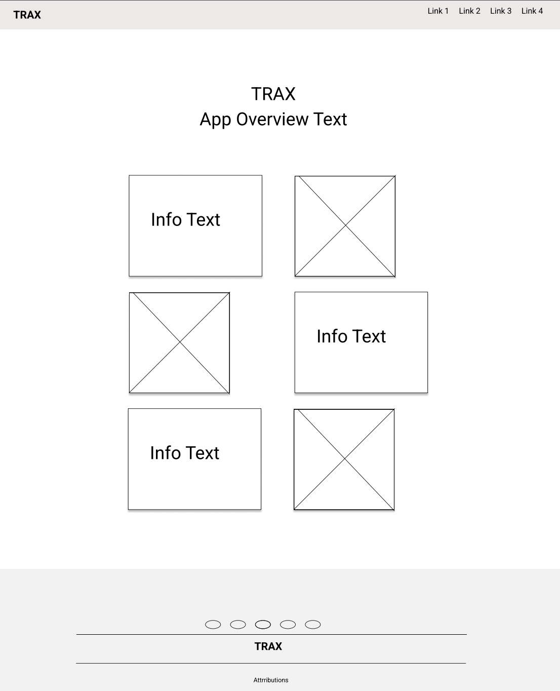
    </details>

The final design is consistent with the proposed wireframes. The only significant change was to the **Home** page. Initially the plan was to have the activity thumbnails display on the left side of the individual activity cards. 

However, for smaller screen sizes, when this collapsed it felt more logical to have the activity description render first followed by the activity thumbnail. As a result, in the final design the thumbnails appear on the right side.

### Color Palette


A broad color palette was chosen for the site with a range of complimenting colors chosen. In choosing the color palette, my objective was to select a color palette that would create a strong visual identity with a number of colors with high contrast.

In defining the colors in the HTML code, the [Tailwind color classes](https://tailwindcss.com/docs/customizing-colors) were used - the color names and their corresponding hex codes are as follows:

| Color Name   | Hex Code   |
|--------------|------------|
| Neutral 100  |  `#f5f5f5` |
| Cyan 800     |  `#155e75` |
| Teal 800     |  `#115e59` |
| Pink 800     |  `#9d174d` |
| Gray 900     |  `#111827` |

### Fonts

For Fonts, I used the [default Tailwindcss fonts](https://tailwindcss.com/docs/font-family). Overall I was happy with the appearance of the site using the default fonts and I did not feel it was necessary to change these.

## Database Model & Schema
In developing the web application, a single database table was defined to store details of the user activities. This table is named **Activity** and is defined in the `models.py` file. All features of the application were captured in this table; the django framework was relied on to manage tables detailing the users and other backend elements.

This **Activity** model contains a number of fields as follows:

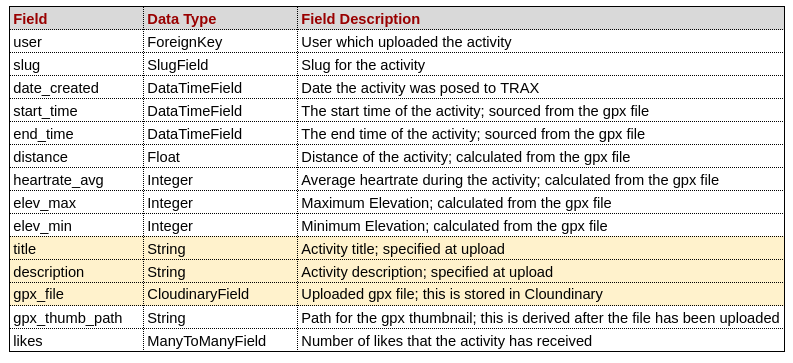

It should be noted that only the fields higlighted are directly modifiable by the user. TRAX automates the population of the remaining fields by either reading these directly from the uploaded `.gpx` file or calculating them. 

For the activity thumbnail, this is generated during the upload process. Once the activity file is uploaded, an activity thumbnail is generated using `plotly` and saved as an `.png`. This file is then uploaded to Cloudinary the resulting Cloudinary path is stored in the database.

The `views.py` file contains a function, `add_activity()` which calls the necessary functions to parse and generate the values for the automated fields before commiting the database entry to the database.

## Features
In designing the site, I have sought to implement features to improve overall user functionability while meeting both the overall site objectives and implementing the proposed user stories.

### Implemented Features
The following screenshots illustrate some of the key features that were implemented in the development of the site:

- **Navbar**
  - <details>
    <summary><strong style="color:skyblue">Screenshot:</strong></summary>
    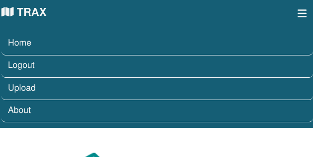
    </details>
  - The site features a standard navbar to aid with navigation of the site
  - Depending on whether the user is logged in or not, the links presented to the user can change (e.g. the Logout link will never be presented to a guest user)
  - The navbar features a hamburger menu which will be rendered on small screen devices  
- **Footer**
  - <details>
    <summary><strong style="color:skyblue">Screenshot:</strong></summary>
    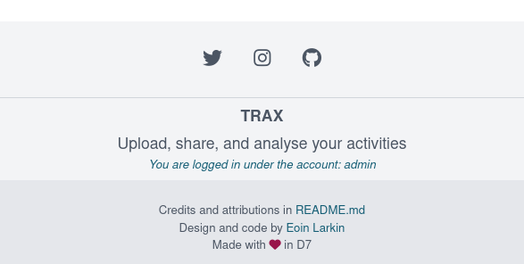
    </details>
  - The site features a standard footer with links to external resources and site attributions
  - If the user is logged in the footer will display the username of the user
- **Signup Page**
  - <details>
    <summary><strong style="color:skyblue">Screenshot:</strong></summary>
    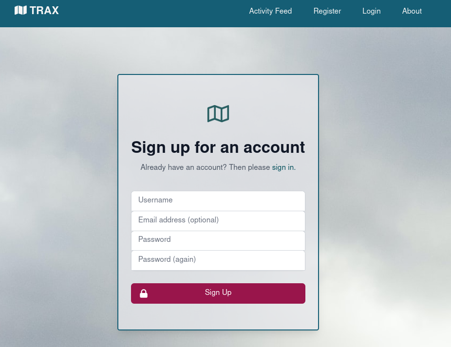
    </details>
  - The signup page allows the user to signup for a new TRAX account.
  - The signup form features defensive programming; the from will not submit unless all required fields are populated.
  - The page features a cover image which scales responsively depending on the device that the user is accessing the site from.
- **Login Page**
  - <details>
    <summary><strong style="color:skyblue">Screenshot:</strong></summary>
    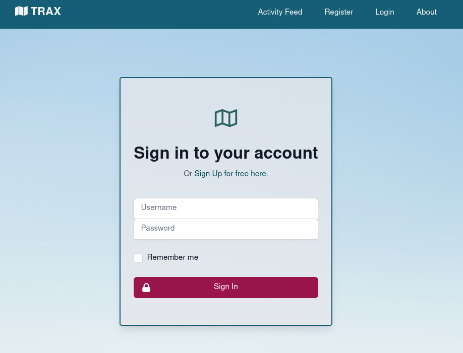
    </details>
  - The login page allows the user to login to their TRAX account.
  - The page features a cover image which scales responsively depending on the device that the user is accessing the site from.
- **Logout Page**
  - <details>
    <summary><strong style="color:skyblue">Screenshot:</strong></summary>
    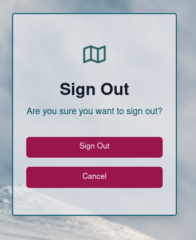
    </details>
  - The logout page allows the user to logout to their TRAX account.
  - In addition to a *Sign Out* button, the page features a *Cancel* button which when clicked will return the user to the main activity feed.
  - The page features a cover image which scales responsively depending on the device that the user is accessing the site from.
- **Activity Feed Page**
  - <details>
    <summary><strong style="color:skyblue">Screenshot:</strong></summary>
    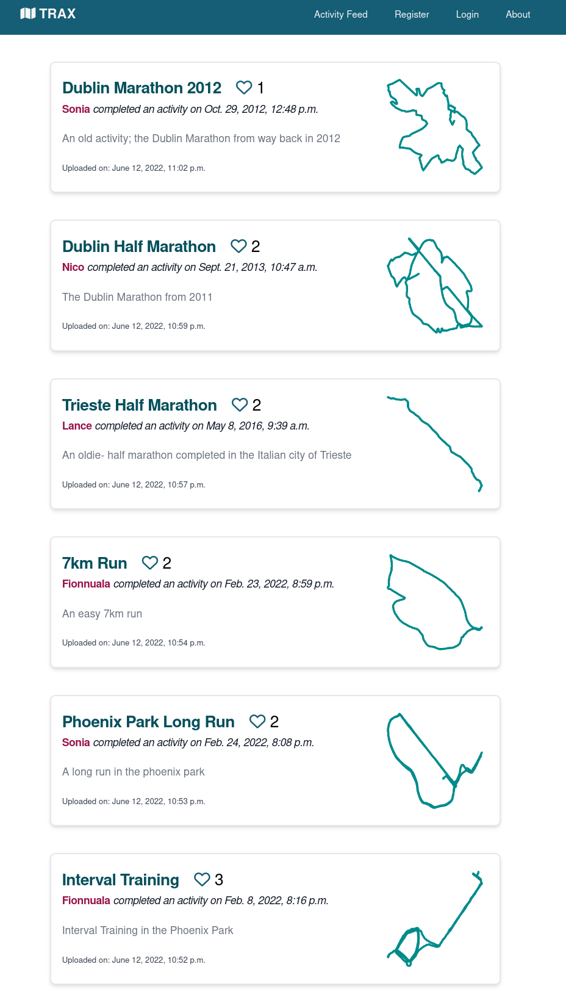
    </details>
  - The activity feed page features the list of activites uploaded by users.
  - If an activity has been uploaded by the logged in user it is highlighted with a colored outline.
  - The activity feed is paginated; each page contains up to 10 activities.
- **Activity Upload Page**
  - <details>
    <summary><strong style="color:skyblue">Screenshot:</strong></summary>
    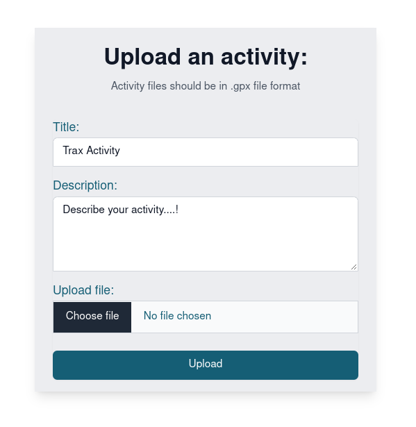
    </details>
  - The user can input both an Activity Name and Description; all other database fields are calculated directly from the `.gpx` file.
  - The page features defensive validation of the file upload type; the form will only allow users to upload files if they have the `.gpx.` file extension.
- **About Page**
  - <details>
    <summary><strong style="color:skyblue">Screenshot:</strong></summary>
    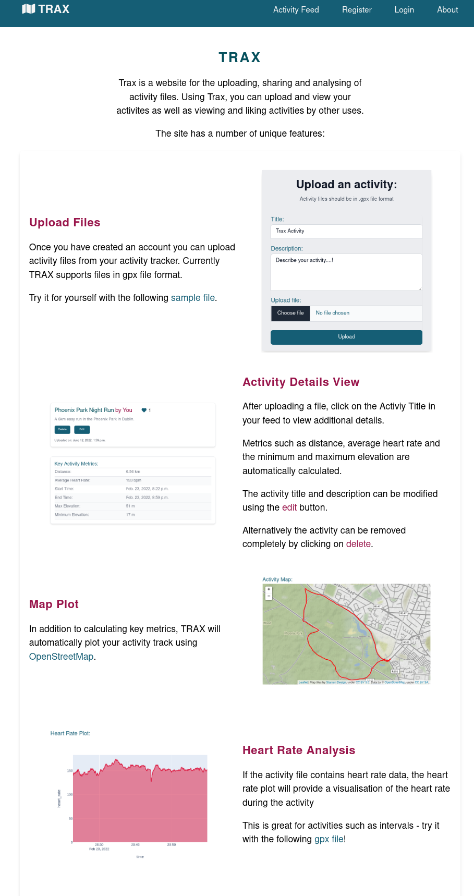
    </details>
  - The about page is designed to serve both as an overview of the site features as well as acting as a tutorial on how to upload the `.gpx` files.
  - The page features a responsive design with the two column alternating content layout collapsing to a single column layout on smaller devices.
- **Activity Detail Page**
  - <details>
    <summary><strong style="color:skyblue">Screenshot:</strong></summary>
    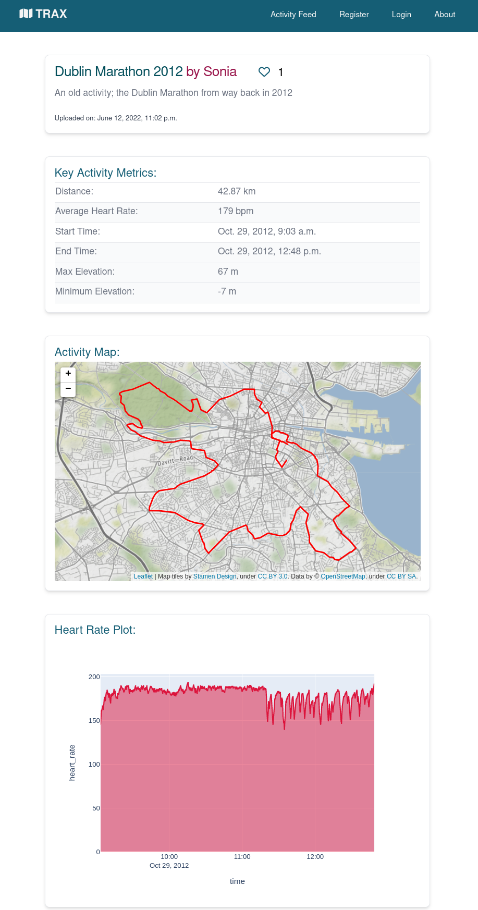
    </details>
  - The activity detail page offers a number of features to aid the user in visualising and understanding their activity file:
    - The activity name and summary are highlighted at the top of the page. The Heart Icon also acts as a button allowing logged in users to like activities
    - If the activity relates to the current logged in user, the user has the option to either **Edit** or **Delete** the activity.
    - Key metrics such as average heart rate, distance and elevation are summarised at the start of the page.
    - Plots are displayed under the key metrics table, with a map providing an overview of the track and separate plots for both heart rate and elevation.
- **Edit Activiy Page**
  - <details>
    <summary><strong style="color:skyblue">Screenshot:</strong></summary>
    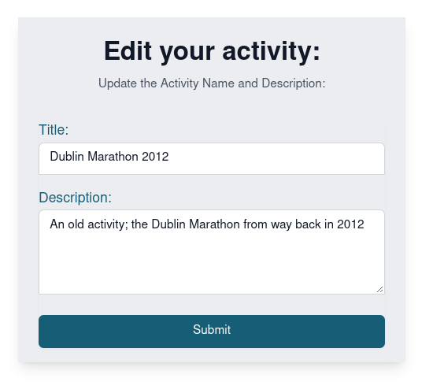
    </details>
  - The user can access this page if they choose to edit an activity that they have uploaded.
  - Within this page, the user can edit either the activity name or description
  - Defensive programming is employed to ensure tha the length of the data input is not longer than the maximum lengths specifed in the database schema.

### Future Additional Features
In developing the web application, I achieved all my major goals for features. However, the following potential future features could be implemented:

- **Activity Deletion Confirmation**
  Present a dialog to user to confirm before activity deletion
- **Additional Activity Files**
  Currently the file only supports `.gpx` files - this could be potentially extended to incorporate other activity file types such as `.fit` and `.tcx`
- **Allow User Comments**
   In addition to allowing users to like activities, a furhter enhancement would be to allow users the ability to comment on other user's activities.
## Testing

The full suite of testing that was completed on the application can be found in the [TESTING.md](TESTING.md) file.

## Deployment

[Heroku](https://www.heroku.com/) was chosen as the hosting platform for the application.

### Heroku Deployment

In order to deploy the application to Heroku, the following steps should be followed:

1. Create a requirements.txt file:
   `pip freeze > requirements.txt`

2. Define a Procfile with the following content for use by Heroku; this should sit in the the root directory:
  `web: gunicorn trax.wsgi`

3. Create a new application in Heroku.

4. Add the following Heroku Resources:
    - *Heroku Postgres*

5. Define the following Environmental Variables in Heroku:

|Key            | Value                           |
|---------------|---------------------------------|
|CLOUDINARY_URL | *Personal Cloudinary URL*       |
|DATABASE_URL   | *Heroku postgres database URL*  |
|SECRET_KEY     | *application secret key*        |

6. Create the database schmea locally by running the following Django commands:

```
 python manage.py makemigrations
 python manage.py migrate
```

7. Create a superuser for the application:
 `python manage.py createsuperuser`

8. Add the hostname of Heroku app to allowed ALLOWED_HOSTS in settings.py:
 `ALLOWED_HOSTS = ['<your Heroku app URL>', 'localhost]`

9. Push the code to GitHub

10. Ensure the Heroku CLI is installed and authenticated. Push the code to Heroku with the following command:
  `git push heroku`

## Technologies Used

In developing the site, the following languages, tools and libraries were used:

### Languages

- Python
- HTML
- CSS
- Jinga

### Tools

- VScode  
  All coding was completed in VS Code.
- Heroku  
  Heroku was used for the deployment of the app.
- [Django](https://www.djangoproject.com/)  
  The Django framework was used to develop the site. 
- PostgreSQL
  This was chosen as the database underlying the site; this was also implemented directly in Herkou using a Heroku Resource.
- [TailwindCSS](https://tailwindcss.com/)
  TailwindCSS was used as teh CSS framework to accelerate development of the site.
- [coolors.co](https://coolors.co/)
  Potential site palettes were tested with Coolors.
- [Figma](https://www.figma.com/templates/wireframe-kits/)
  Wireframes for the site were generated using Figma
- [gauger.io](gauger.io)
  This website was used to generate the favicon using an icon from Font Awesome.
- [Markdown TOC](https://ecotrust-canada.github.io/markdown-toc//)
  For generating the formatted table of contents in markdown

## Credits

In developing the site, a number of tools, external libraries and resources were consulted.

### Libraries

In developing the site the following open source libraries were utilised:

- [gpxpy](https://github.com/tkrajina/gpxpy)
  Python library for parsing GPX files; used to read the GPX files for plotting using
- [folium](https://python-visualization.github.io/folium/)
- [plotly.py](https://github.com/plotly/plotly.py)  
  Plotly was used to generated the remaining plots and to plot and render the track thumbnail image

### Code
The final code / tutorials  references were consulted when developing the site features:

- [Limiting File Uploads](https://stackoverflow.com/questions/4328947/limit-file-format-when-using-input-type-file)  
 This StackOverflow post was consulted to ensure that the file upload dialog would only accept `gpx` files.
- [Creating a Unique Slug](https://stackoverflow.com/questions/3816307/how-to-create-a-unique-slug-in-django)
- [Upload File and read contents to populate model](https://stackoverflow.com/questions/6091965/django-upload-a-file-and-read-its-content-to-populate-a-model)  
This stackover flow was referenced in order to understand how to upload a file and then use the same file to populate the underlying database model
- **Folium Integration**
  The following two tutorials were referenced in order to understand how to plot the `.gpx` files using the `folium` library:
  - [Folium and Django](https://hatarilabs.com/ih-en/developing-geospatial-webapps-with-python-and-django-tutorial)
  - [Overlay gpx on Folium Map](https://gpxplotter.readthedocs.io/en/latest/auto_examples/maps/plot_000_segment.html#sphx-glr-auto-examples-maps-plot-000-segment-py)
- [GPXPY to dataframe](https://www.gpxz.io/blog/gpx-file-to-pandas)
- [Deleting a Post / Activity](https://stackoverflow.com/questions/71016875/django-button-to-remove-row-in-sqlite3)
- [Cloudinary: Upload of non image files](https://stackoverflow.com/questions/36805137/how-to-pass-options-to-cloudinaryfield-in-django-model)
- [Autogenerate the Slug](https://stackoverflow.com/questions/50436658/how-to-auto-generate-slug-from-my-album-model-in-django-2-0-4)
- [Plotting Elevation Data](https://www.gpxz.io/blog/gpx-file-to-pandas)

### HTML / CSS
  - Template code for the NavBar was sourced from the [Flowbite Navbar Template](https://flowbite.com/docs/components/navbar/)
  - Template code for the card layout was sourced from the [Flowbite Card Template](https://flowbite.com/docs/components/card/)
  - Template code for the Footer was sourced from the [Tailwind Components Footer Template](https://tailwind-elements.com/docs/standard/navigation/footer/)

### Images

Images for the **Register**, **Sign-In** and **Logout** page were sourced from Unsplash as follows:
    - [Alessio Soggetti](https://unsplash.com/photos/GYr9A2CPMhY): Runner in fields
    - [Eugene Zhyvchik](https://unsplash.com/photos/zQnI-b2aSxI): Hiker in Hills
    - [Todd Diemer](https://unsplash.com/photos/fpNBYsymggk): Climbers in Mountains

### Other

- The CodeInstitue Modules on Python and in particular cloud deployment to Heroku
- My friends and families who supported me by beta testing iterations of the site
- [Strava](https://www.strava.com) for providing the original inspiration for the site
